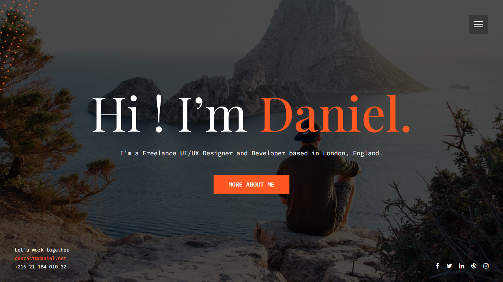
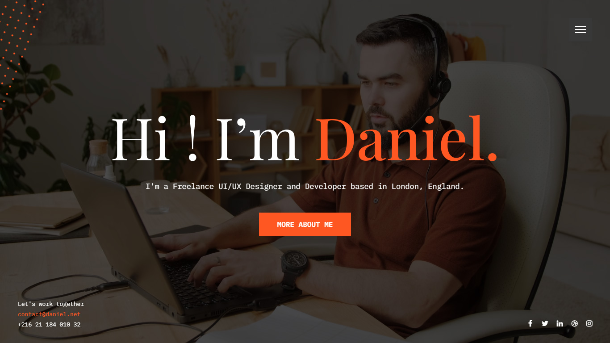
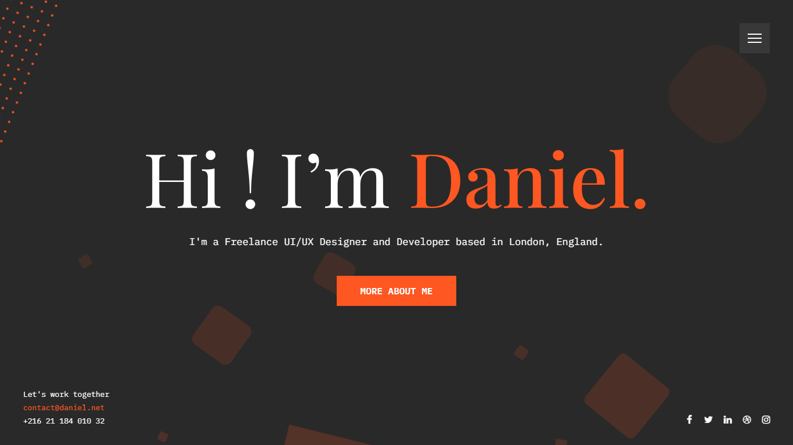
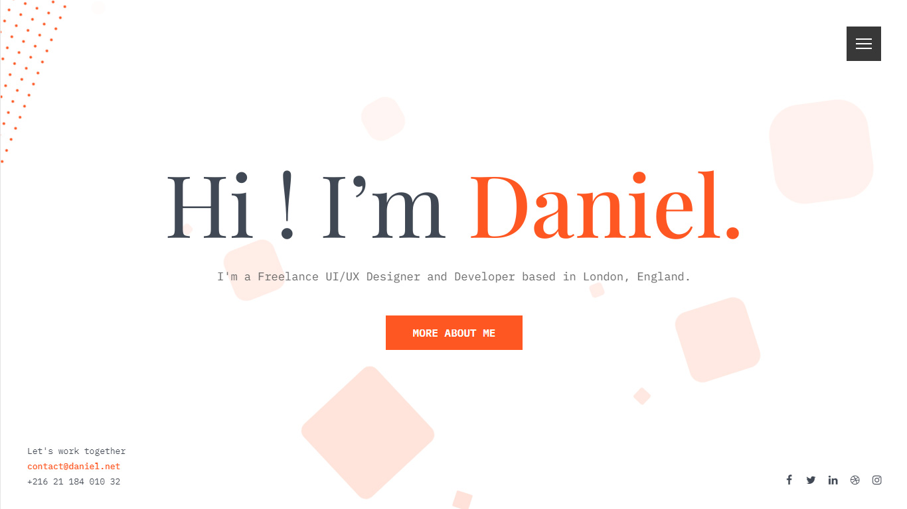

<!DOCTYPE html>
<html lang="en">

    <head>
        <meta charset="utf-8">
        <meta name="viewport" content="width=device-width, initial-scale=1.0">
        <meta name="description" content="">
        <meta name="author" content="Uniquecrew">

        <!-- Favicon -->
        <link rel="shortcut icon" href="assets/images/favicon.ico.html">

        <!-- Title -->
        <title>Sliim - Personal Portfolio</title>

        <!-- Google fonts -->
        <link rel="preconnect" href="https://fonts.gstatic.com">
        <link href="https://fonts.googleapis.com/css2?family=Asap:wght@400;500;600;700&display=swap" rel="stylesheet">

        <!-- Bootstrap core CSS -->
        <link href="assets/css/bootstrap.min.css" rel="stylesheet">
        <link href="assets/css/materialdesignicons.min.css" rel="stylesheet">
        <link href="assets/css/twentytwenty.css" rel="stylesheet" type="text/css">

        <!-- Custom styles for this template -->
        <link href="assets/css/demo.css" rel="stylesheet">

        <!-- HTML5 shim and Respond.js IE8 support of HTML5 tooltipss and media queries -->
        <!--[if lt IE 9]>
            
            
        <![endif]-->

    </head>

    <body>
        

        <!-- HOME -->
        <section class="bg-home-half border-bottom" style="background:url('assets/images/bg.jpg') center center;">
            

                

                    

                        

                            

                                

                                    <h1 class="mb-0 text-white text-uppercase">Sliim</h1>
                                    <h2 class="text-white pt-2 text-uppercase">Personal Portfolio</h2>
                                    
 
                                        <a href="#demos" class="btn btn-custom mouse-down m-1">View Demos</a>
                                        <a href="#" class="btn btn-outline-white m-1">Download Now</a>
                                    

                                

                            

                        

                    

                

            

        </section>
        <!-- HOME -->

        <!-- DEMOS -->
        <section class="section my-0 my-md-5" id="demos">
            

                

                    

                        

                            <h2 class="mb-4 text-uppercase font-weight-bold">Template Demos</h2>
                        

                    

                

                

                    

                        

                            
                            <h4 class="mt-4 text-uppercase">Image Background</h4>
                        

                    

                    

                        

                            
                            <h4 class="mt-4 text-uppercase">Video Background</h4>
                        

                    

                

                

                    

                        

                            
                            <h4 class="mt-4 text-uppercase">Animated Background Dark</h4>
                        

                    

                    

                        

                            
                            <h4 class="mt-4 text-uppercase">Animated Background Light</h4>
                        

                    

                

            

        </section>
        <!-- DEMOS -->
        
        <!-- FOOTER -->
        <section class="footer-three bg-dark">
            

                

                    

                        

                            
 © ducor. Designed with <i class="mdi mdi-heart text-danger"></i> by <a href="https://themeforest.net/user/ducor" target="_blank" class="text-reset">ducor</a>.

                        

                    
<!--end col-->
                
<!--end row-->
            

        </section>
        <!-- FOOTER -->       

        <!-- Back to top -->
        <a href="#" class="back-to-top rounded shadow text-center" id="back-to-top"> 
            <i class="mdi mdi-chevron-up mdi-18px d-block text-custom"> </i> 
        </a>
        <!-- Back to top -->

        <!-- js placed at the end of the document so the pages load faster -->
        
                   
        
        
        
        
        
        
        

    </body>

</html>